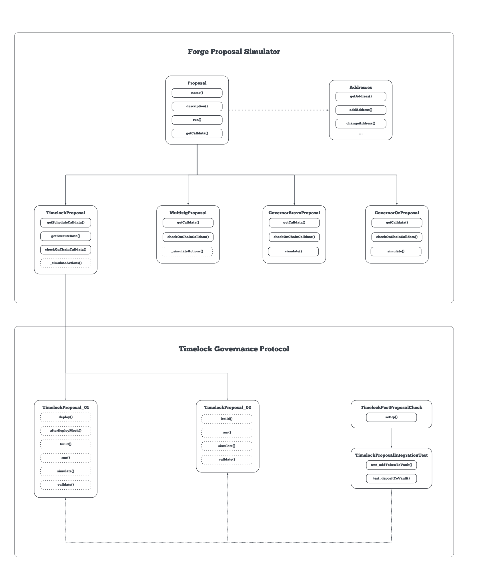

# Architecture

The diagram illustrates the architecture of the Forge Proposal Simulator. It is
composed of various components that interact with each other to simulate,
execute and test governance proposals.

## Proposal Generic Contract

At its core, the FPS features a **Proposal Contract**. This contract defines
[external](external-functions.md) and [internal](internal-functions.md)
functions, customizable by the protocol utilizing FPS. The `run` function serve as the entry point to execute a proposal.

## Governance Specific Contracts

FPS accommodates different Governance types (e.g., Timelock, Multisig) through specialized contracts. These Governance Specific Contracts inherit from the Proposal Contract, tailoring their functions to unique governance requirements.

## Proposal Specific Contract

Protocols using FPS must create their own Proposal Specific Contracts, conforming to FPS standards. These contracts override functions relevant to the particular proposal, such as `_deploy()` and `_afterDeploy()` for proposals involving new contract deployments. For more details, refer to [internal functions](internal-functions.md).

## Test Suite

An integral part of FPS, the Test Suite includes a `testProposals()`
method. This contract interacts with the `Addresses` object, holding key addresses for the proposal process.

## Post Proposal Check

Protocols must implement a `Post Proposal Check` contract. This contract is tasked with deploying Proposal instances and invoking `TestSuite.testProposals()` for simulation purposes. Integration tests should inherit from `Post Proposal Check`.

## Script Suite

Serves as a multipurpose tool. Primarily used for proposal simulation, it can also execute proposals on-chain when used with the `--broadcast` flag. The Script Suite works alongside the `Addresses` object to manage proposal address references. For enhanced security in proposal transaction creation, FPS scripts can integrate with CI pipelines. More information is available in [Using with actions](../../testing/using-with-actions.md).


[design-philosophy.md](design-philosophy.md)



[external-fuctions.md](external-fuctions.md)



[internal-functions.md](internal-functions.md)



[addresses.md](addresses.md)

