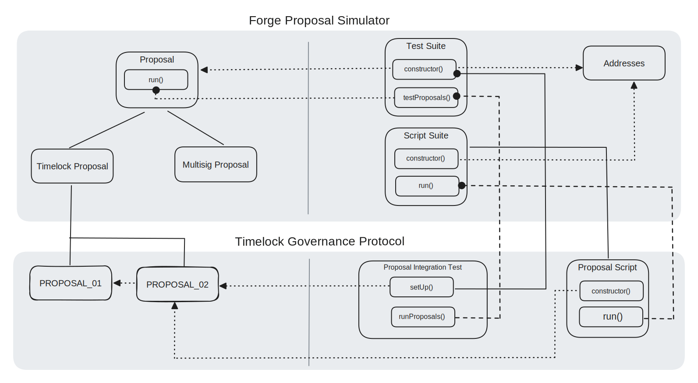

# Architecture

The diagram illustrates the architecture of the Forge Proposal Simulator. It is composed of various components that interact with each other to simulate and test governance proposals.

## Proposal Interface

The central component is the Proposal contract, which defines [external](external-functions.md) and
[internal](internal-functions.md) functions that can be override.
The `run` function is the entry point for executing the logic contained within a
proposal.

## Test Suite

The test suite contains a `testProposals()` method responsible for running the
FPS proposal contracts. It interacts with the `Addresses` object, which holds references to the addresses involved in the proposal process.

## Script Suite

The script suite is a generic script that can be used not only to simulate any governance
proposal, but also to execute the proposal on-chain when using `--broadcast`
flag. It interacts with the `Addresses` object, which holds references to the
addresses involved in the proposal process.
FPS scripts can be executed on CI pipelines, which adds a layer of security when
generating proposal transactions. Check [Using with actions](../../testing/using-with-actions.md) for more details.


[design-philosophy.md](design-philosophy.md)



[external-fuctions.md](external-fuctions.md)



[internal-functions.md](internal-functions.md)



[addresses.md](addresses.md)

