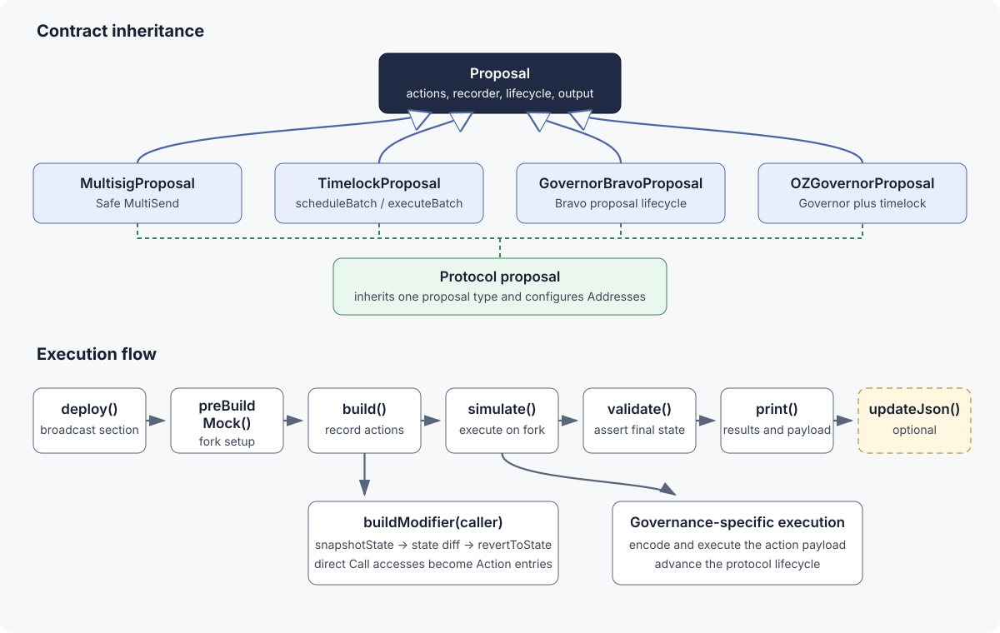

# Architecture

[`Proposal.sol`](../../../src/proposals/Proposal.sol) defines the action model,
lifecycle flags, build recorder, default duplicate-action check, and output
format. Governance-specific contracts inherit it and implement calldata
encoding and simulation for Safe, OpenZeppelin Timelock, Governor Bravo, and
OpenZeppelin Governor.

A protocol proposal inherits one governance-specific contract. Its `run()`
selects the fork, creates the [address registry](addresses.md), configures the
governance contract, and calls `super.run()`.

During `build()`, `buildModifier(caller)` pranks as the privileged caller,
takes a Foundry state snapshot, and records the state diff. FPS restores the
snapshot and converts direct `Call` accesses from that caller into `Action` entries. The
same recording supplies the state-slot and transfer changes printed with the
proposal.

`simulate()` executes the encoded actions through the selected governance
system. `validate()` checks the resulting fork state. `print()` emits the
description, actions, recorded changes, and governance calldata or Safe
transaction fields.


[Lifecycle, flags, and proposal functions](proposal-functions.md)



[Address registry](addresses.md)

