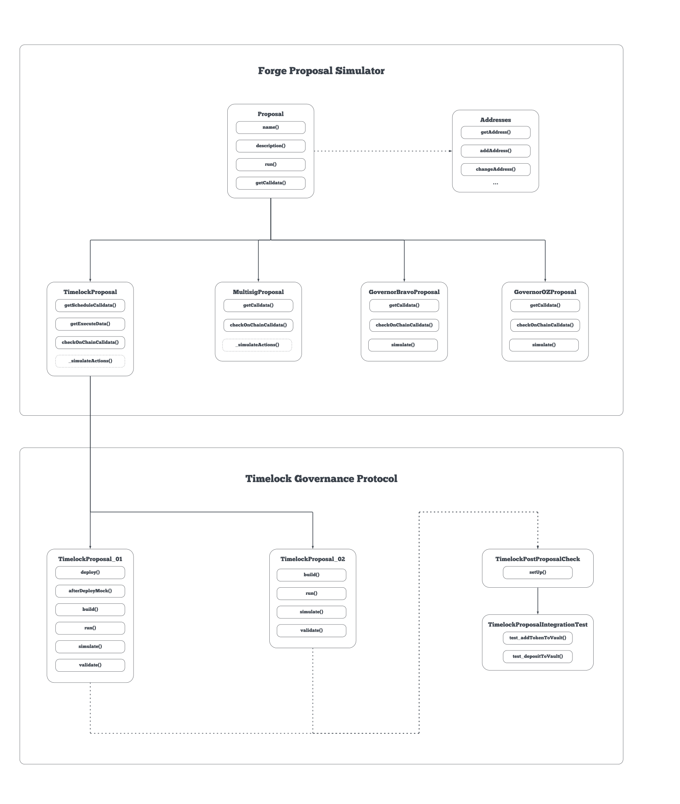

# Architecture

The diagram illustrates the architecture of the Forge Proposal Simulator. It is composed of various components that interact with each other to simulate, execute, and test governance proposals.

## Proposal Generic Contract

At its core, the FPS features a [Proposal.sol](../../../src/proposals/Proposal.sol) contract that defines [functions](proposal-functions.md) that can be overridden to adapt to specific governance architectures. The `run` function serves as the entry point to execute a proposal using the `forge script`.

## Governance Specific Contracts

FPS supports different Governance types (e.g., Timelock, Multisig, Governor Bravo, Governor OZ) through proposal contract types inheriting from [Proposal.sol](../../../src/proposals/Proposal.sol), customizing their functions to unique governance requirements. New proposal types can be included to support different governance contracts.

## Proposal Specific Contract

Protocols using FPS must create their own Proposal Specific Contracts, conforming to FPS standards. These contracts override functions relevant to the particular proposal, such as `deploy()` and `afterDeployMock()` for proposals involving new contract deployments. For more details, refer to [proposal functions](proposal-functions.md).


[proposal-functions.md](proposal-functions.md)



[addresses.md](addresses.md)

